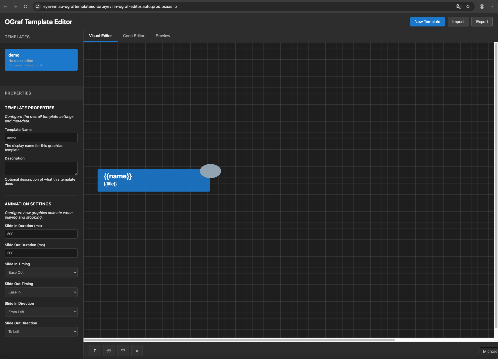

# OGraf Template Editor

A web-based graphics template editor for broadcast based on the EBU OGraf standard. Create professional broadcast graphics without needing to be a graphic designer.



---

<div align="center">

## Quick Demo: Open Source Cloud

Run this service in the cloud with a single click.

[](https://app.osaas.io/browse/eyevinn-ograf-editor)

</div>

---

## Features

### Visual Editor
- **Drag-and-drop interface** for creating graphics elements
- **Real-time canvas preview** with visual element manipulation
- **Element toolbar** with text, images, rectangles, and circles
- **Property panel** for fine-tuning element styles and properties
- **Responsive design** with proper layout handling

### Code Editor
- **Monaco Editor integration** with full syntax highlighting
- **JSON manifest editor** with real-time validation and error detection
- **JavaScript component viewer** for generated web components
- **Tabbed interface** switching between manifest and component code
- **Professional code editing** with IntelliSense support

### Preview Engine
- **Real-time preview** with animation support
- **Play/Stop controls** for testing graphic animations
- **Dynamic data inputs** for testing template variables
- **Animation controls** with configurable directions and timing
- **Export functionality** for generating preview images

### Template Management
- **Template creation wizard** with predefined types
- **Local storage persistence** for template management
- **Import/Export functionality** for sharing templates
- **Template validation** against OGraf specification
- **Responsive template list** with proper scrolling

### Advanced Animation System
- **Slide animations** with 4-direction support (left, right, top, bottom)
- **Independent slide-in/slide-out** direction controls  
- **Configurable timing** functions (ease-in, ease-out, linear, ease-in-out)
- **Real-time animation preview** in the preview engine
- **OGraf-compliant custom actions** (slideIn, slideOut)

## Getting Started

### Prerequisites

- Node.js (version 16 or higher)
- Modern web browser (Chrome, Firefox, Safari, or Edge)

### Installation

1. Clone or download this repository
2. Install dependencies:
   ```bash
   npm install
   ```

3. Start the development server:
   ```bash
   npm run dev
   ```

4. Open your browser to `http://localhost:3000`

## Usage

### Creating Your First Template

1. Click "Create Your First Template" or "New Template"
2. Choose a template type:
   - **Lower Third**: Name and title overlays
   - **Title**: Full-screen title cards
   - **Bug**: Small station logos/branding
   - **Custom**: Start from scratch

3. Fill in the template details and click "Create"

### Visual Editor

- **Add Elements**: Use the toolbar to add text, images, rectangles, or circles
- **Move Elements**: Click and drag elements to reposition them
- **Resize Elements**: Select an element and drag the corner handles
- **Delete Elements**: Select an element and press Delete key

### Property Panel

- **Element Properties**: Modify position, size, and content of selected elements
- **Style Properties**: Change colors, fonts, borders, and other visual styles
- **Template Properties**: Configure data inputs for your template

### Preview

- **Data Inputs**: Enter sample data to see how your template will look
- **Play/Stop**: Test template animations and transitions
- **Update**: Refresh preview with new data

### Code Editor

- **Manifest Tab**: Edit the OGraf manifest JSON directly
- **Component Tab**: Modify the Web Component implementation
- **Validation**: Real-time validation of your code

### Export/Import

- **Export**: Save templates as OGraf-compatible files
- **Import**: Load existing OGraf templates
- **Formats**: Support for JSON and OGraf bundle formats

## OGraf Specification Compliance

This editor generates templates that are **fully compliant** with the [EBU OGraf v1 specification](https://ograf.ebu.io/v1/specification/docs/Specification.html):

### Manifest Compliance
- **$schema**: Proper JSON schema validation
- **Required fields**: id, name, main, supportsRealTime/supportsNonRealTime
- **Custom actions**: Standardized slideIn/slideOut actions
- **Data schema**: Proper parameter definitions for dynamic content
- **Step count**: Single-step graphics support

### Web Component Compliance
- **HTMLElement inheritance**: Standard web component structure
- **Shadow DOM**: Style encapsulation and isolation
- **ES Module exports**: Proper module system compatibility
- **Required lifecycle methods**:
  - `load()`: Initialize the graphic
  - `dispose()`: Clean up resources
  - `playAction()`: Show/animate the graphic
  - `stopAction()`: Hide the graphic
  - `updateAction(data)`: Update with new data
  - `customAction(action, data)`: Handle custom actions

### Template Structure
Each template consists of:
- **Manifest** (`.ograf.json`): Metadata and schema definition
- **Web Component** (`.mjs`): HTML/CSS/JavaScript implementation
- **Generated code**: Fully compliant with OGraf rendering systems

## Browser Compatibility

- **Chrome 90+** (recommended for best Monaco Editor experience)
- **Firefox 88+** (full feature support)
- **Safari 14+** (Web Components and ES6 modules support)
- **Edge 90+** (Chromium-based, full compatibility)

### Requirements
- **ES6 Modules**: For web component loading
- **Custom Elements v1**: For OGraf web components
- **Shadow DOM v1**: For style encapsulation
- **Dynamic Imports**: For Monaco Editor loading

## Development

### Project Structure

```
src/
├── components/          # UI components
│   ├── VisualEditor.js   # Drag-and-drop editor
│   ├── PropertyPanel.js  # Element properties
│   ├── PreviewEngine.js  # Template preview
│   └── CodeEditor.js     # Code editing
├── models/              # Data models
│   └── OGrafTemplate.js  # Template structure
├── services/            # Business logic
│   ├── TemplateManager.js      # Template CRUD
│   └── ExportImportService.js  # File operations
├── styles/              # CSS styles
│   ├── main.css         # Base styles
│   └── components.css   # Component styles
└── main.js              # Application entry point
```

### Build Commands

```bash
npm run dev      # Start development server
npm run build    # Build for production
npm run preview  # Preview production build
npm run lint     # Run ESLint
npm run typecheck # Run TypeScript checks
```

## Contributing

1. Fork the repository
2. Create a feature branch
3. Make your changes
4. Test thoroughly
5. Submit a pull request

## License

MIT License - see LICENSE file for details

## Resources

- [EBU OGraf Specification](https://ograf.ebu.io/)
- [OGraf GitHub Repository](https://github.com/ebu/ograf)
- [EBU Technology & Innovation](https://tech.ebu.ch/)

## Support

For issues and questions:
- Check the documentation at [ograf.ebu.io](https://ograf.ebu.io/)
- Review existing issues in the repository
- Create a new issue with detailed information

---

Built with love for the broadcast community
